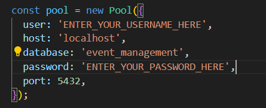
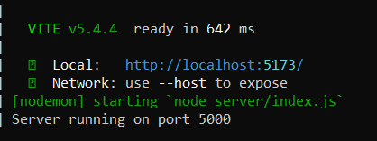
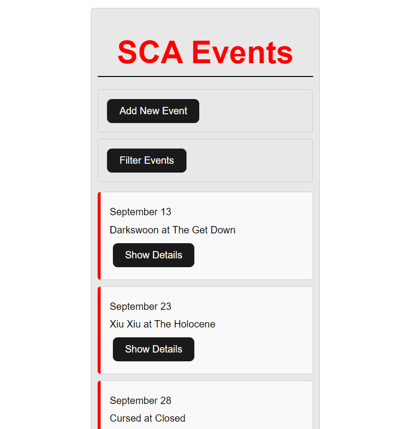
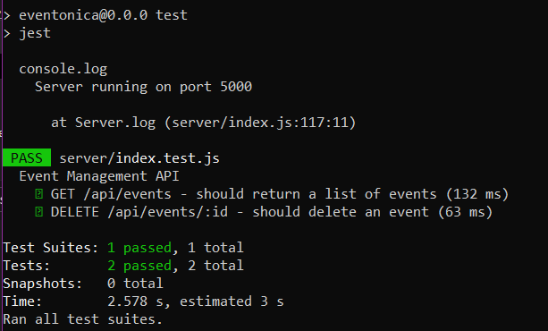

1) First clone the repo, then navigate to the server folder and open up PostgreSQL with the command ```sudo -u postgres psql```.

2) If you do not already have a psql username and password set up, create one from the psql command line with the command ```CREATE USER ENTER_YOUR_USERNAME_HERE WITH PASSWORD 'ENTER_YOUR_PASSWORD_HERE';```

3) Be sure to update your pool variables and change the user and password that you use in the 'index.js' file and the 'populateDatabase.js' file:



4) Back in your psql terminal, enter the command ```CREATE DATABASE event_management;```

5) Next, enter the command ```GRANT ALL PRIVILEGES ON DATABASE event_management TO ENTER_YOUR_USERNAME_HERE;```

6) Now, navigate to the new database with ```\c event_management;``` and create the events table with the command:
```
CREATE TABLE events (
  id SERIAL PRIMARY KEY,
  date VARCHAR(255) NOT NULL,
  time VARCHAR(255) NOT NULL,
  ticketPrice VARCHAR(255) NOT NULL,
  bandName VARCHAR(255) NOT NULL,
  venueName VARCHAR(255) NOT NULL,
  venueAddress VARCHAR(255) NOT NULL
);

```
7) Once the table is created, be sure to enter the commands ```GRANT ALL PRIVILEGES ON TABLE events TO ENTER_YOUR_USERNAME_HERE;``` and ```GRANT USAGE, SELECT ON SEQUENCE events_id_seq TO ENTER_YOUR_USERNAME_HERE;``` from the psql command line.

8) Enter the command ```\q``` to exit the psql terminal, and run ```node populateDatabase.js```. You should see a message that says ```All events have been inserted into the database.``` logged to the console, this is to make sure your table is populated correctly.

9) Now, return to your root directory and run the command ```npm start```. This should start your server, you'll know it's started properly when you see this:



10) Once the server is running, you can navigate to localhost:5173 in your browser. From this page you can search through the events with filter, add events with add events, and show details will give you the option to edit, delete, or like an event. it should look like this:



11)  Last but not least, let's run tests!To run tests, make sure you're in the root directory and run the command ```npm test``, this should run the jest tests located in index.test.js, and the following should show in your terminal:


